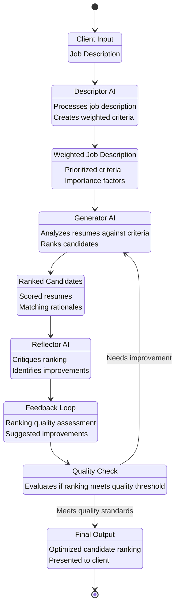

# ATSAnalyser

This program takes a job description and ranks candidate resume according to relevency using LLM's.


# Installation
```
1. git clone https://github.com/xezbeth/ATSAnalyser.git
2. cd ATSAnalyser
3. pip install -r requirements.txt
4. streamlit run main.py
```

Once the streamlit app opens, you can type the desired job description into the text field and click the generate weighted job descriptino button.

Then select the number of threads(this indicates the number of resume to be analyzes at a time) and click analyse.

The result should appear at the top as a table with ranking.

# Diagram



